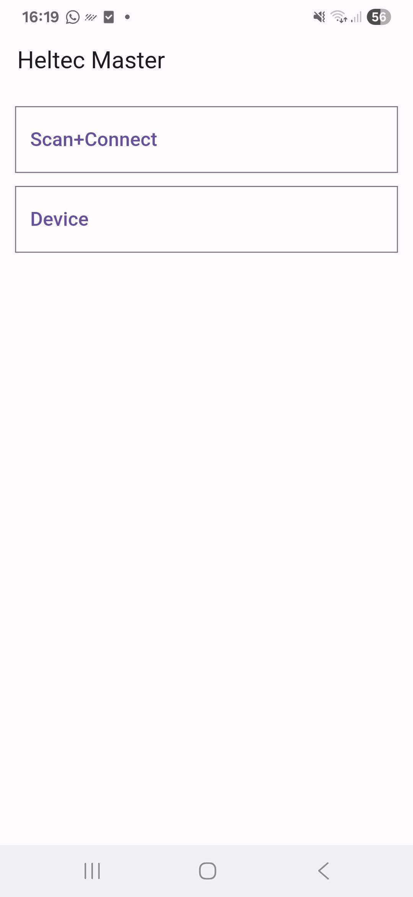
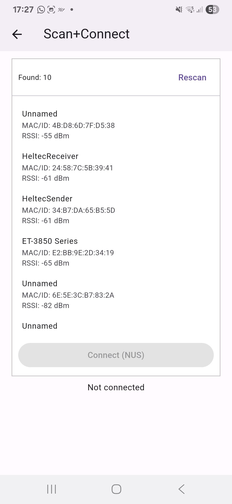
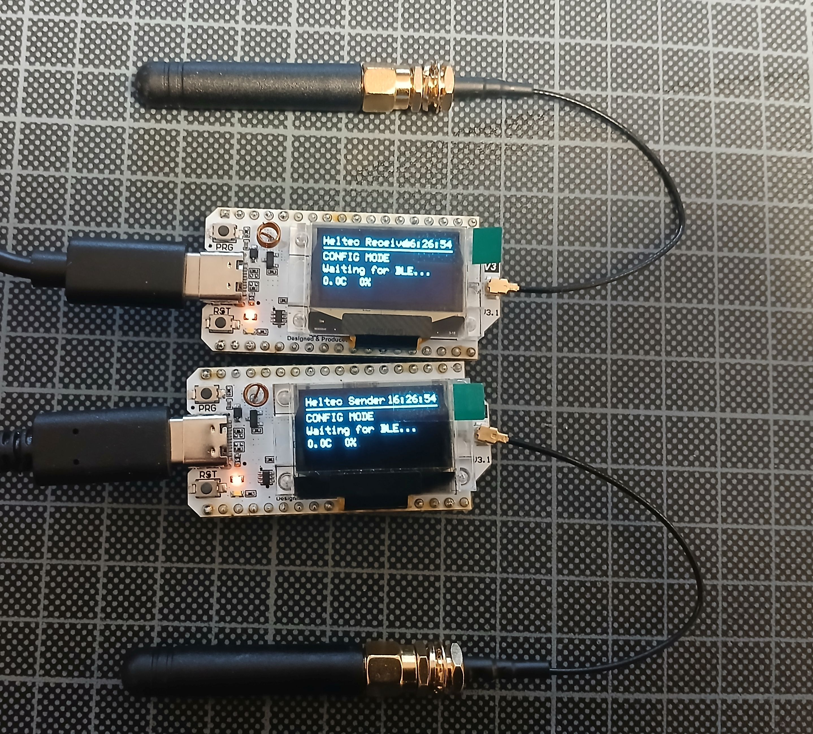
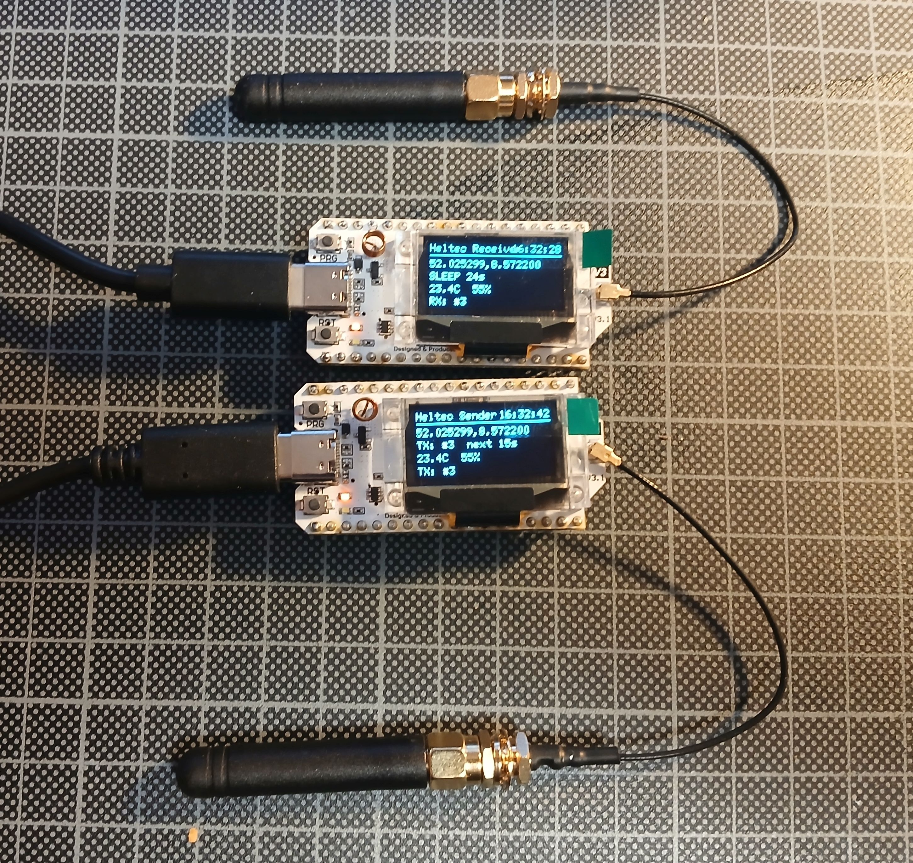
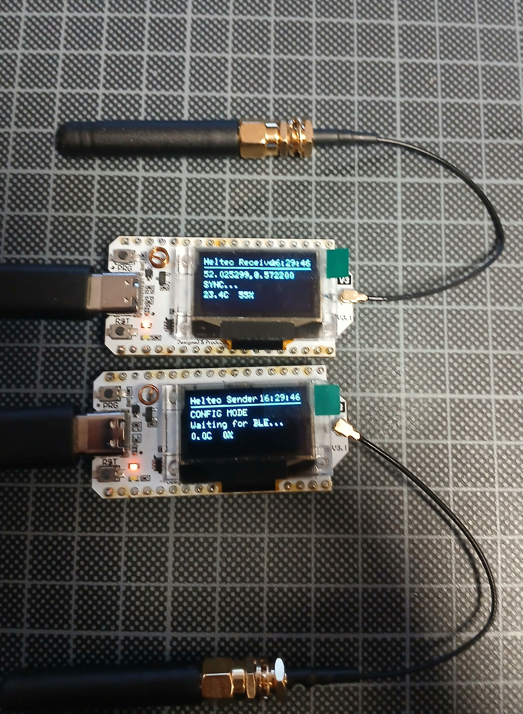

# Heltec Master (lora_monitor)

Flutter-App zur BLE-Kommunikation mit Heltec-Geräten über den Nordic UART Service (NUS).

## Funktionen

- **BLE-Scanning**: Automatische Suche nach Bluetooth-Low-Energy-Geräten in der Umgebung
- **NUS-Verbindung**: Verbindung zu Geräten über den Nordic UART Service (6e400001-b5a3-f393-e0a9-e50e24dcca9e)
- **JSON-Kommunikation**: Bidirektionale Kommunikation über JSON-Nachrichten
- **Geräteinformationen**: Abruf von Gerätedaten wie Name, Seriennummer, Batterie, Position, Helligkeit und Temperatur

## Screens

### Home Screen
Hauptmenü mit Navigation zu den beiden Funktionsbereichen:
- **Scan+Connect**: BLE-Geräte scannen und verbinden
- **Device**: Verbundenes Gerät anzeigen und steuern

| Home | Scan+Connect | Device |
|:----:|:------------:|:------:|
|  |  |  |

### Scan+Connect Screen
- Automatischer BLE-Scan beim Öffnen (6 Sekunden)
- Liste gefundener Geräte, sortiert nach Signalstärke (RSSI)
- Anzeige von Gerätename, MAC-Adresse und RSSI
- Gerät auswählen und per "Connect (NUS)" verbinden
- Rescan-Button zum erneuten Scannen
- Statusanzeige der aktuellen Verbindung

### Device Screen
- Anzeige des verbundenen Geräts und Verbindungsstatus
- "Read Info (JSON via NUS)"-Button zum Abrufen der Geräteinformationen
- Anzeige der empfangenen Daten:
  - DeviceName
  - Serial
  - Position
  - Temperature
  - Humidity
  - Time
- **Konfiguration** (set_config):
  - Seriennummer (sn, max. 31 Zeichen)
  - Device-ID (0–255)
  - Mode (Off, Steady, Blink Async, Blink Sync, Blink Backlight)
  - Senden-Button zum Übertragen der Konfiguration
  - ACK/Error-Rückmeldung per Snackbar
- Disconnect-Button zum Trennen der Verbindung

## Hardware

Heltec LoRa-Geräte (Receiver und Sender) mit OLED-Display und Antenne:

| Config Mode | Operational Mode | BLE Sync Mode |
|:-----------:|:----------------:|:-------------:|
|  |  |  |
| Beide Geräte im Config Mode, warten auf BLE-Verbindung | Beide Geräte im Betrieb mit Sensordaten | Receiver im Betrieb, Sender im Config Mode |

## NUS-Protokoll

Die App kommuniziert über den Nordic UART Service:

| Charakteristik | UUID | Funktion |
|----------------|------|----------|
| Service | 6e400001-b5a3-f393-e0a9-e50e24dcca9e | NUS Service |
| RX | 6e400002-b5a3-f393-e0a9-e50e24dcca9e | Schreiben (App → Gerät) |
| TX | 6e400003-b5a3-f393-e0a9-e50e24dcca9e | Notify (Gerät → App) |

**Beispiel-Befehl:**
```json
{"cmd":"get_info"}
```

**Beispiel-Antwort:**
```json
{"devicename":"HeltecMaster","serial":"ABC123","battery":87,"position":"...","brightness":50,"temperature":23}
```

## Installation

```bash
# Dependencies installieren
flutter pub get

# App starten
flutter run

# APK bauen
flutter build apk
```

## Voraussetzungen

- Flutter SDK 3.3.3+
- Android: minSdkVersion 21 (Android 5.0+)
- iOS: Xcode für iOS-Builds
- Berechtigungen: Bluetooth Scan, Bluetooth Connect, Location

## Abhängigkeiten

- [flutter_blue_plus](https://pub.dev/packages/flutter_blue_plus) - BLE-Kommunikation
- [permission_handler](https://pub.dev/packages/permission_handler) - Berechtigungsverwaltung

## Entwicklung

### Build-Tools

| Tool | Version | Zweck |
|------|---------|-------|
| Flutter SDK | 3.19.5 (stable) | Framework & Build-System |
| Dart SDK | 3.3.3 | Programmiersprache |
| Android SDK | minSdk 21, compileSdk via Flutter | Android-Builds |
| Gradle | mit Android Gradle Plugin | Android Build-Automatisierung |
| Kotlin | JVM Target 1.8 | Android-Platform-Code |

### Build-Befehle

```bash
# Dependencies installieren
flutter pub get

# App im Debug-Modus starten
flutter run

# Release-APK bauen
flutter build apk

# Code analysieren
flutter analyze

# Code formatieren
dart format lib/

# Tests ausführen
flutter test
```

### Entwicklungswerkzeuge

| Tool | Zweck |
|------|-------|
| Windows 11 Pro | Entwicklungsplattform (Build 26200.7840) |
| Android Studio | IDE, Android-Emulator, SDK-Verwaltung |
| VS Code | Code-Editor mit Flutter/Dart-Extensions |
| Claude Code (CLI) | KI-gestütztes Coding, Refactoring und Dokumentation |
| Git | Versionskontrolle |
| DevTools | Flutter-Debugging und Performance-Analyse |
